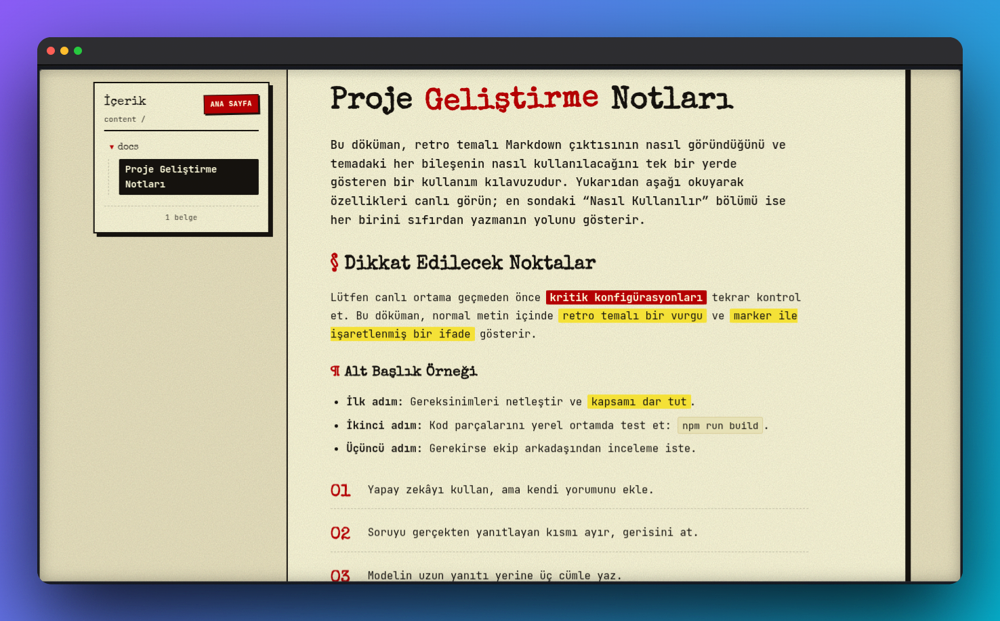

<p align="center">
  
</p>

<p align="center">
  <strong>Markdown içeriği pandoc ile statik, retro temalı doküman sitesine dönüştüren derleyici.</strong>
</p>

<p align="center">
  
  
  <a href="LICENSE"></a>
</p>

goodoc, `content/` dizinine eklenen Markdown dosyalarını tarar, her birini `pandoc` ile HTML'e dönüştürür ve `build/` dizininde kenar çubuğu, görsel büyütme ve retro tema desteğine sahip statik bir site üretir. Sayfa iskeleti, gezinme ağacı ve varlık (attachment) yönetimi derleyici tarafından otomatik olarak oluşturulur; kullanıcının yapması gereken yalnızca Markdown yazmaktır.

Bileşenlerin tam kataloğu için `content/docs/dokuman.md` dosyasına bakılabilir; başlıklar, tablolar, kod blokları, alıntılar ve görsellerin canlı örnekleri bu dosyada yer alır.

## Hızlı başlangıç

```bash
git clone https://github.com/ArdaYILDIZ-DEV/goodoc.git
cd goodoc

python build.py
```

`pandoc` sistemde kurulu değilse önce paket yöneticisiyle kurulmalıdır:

```bash
sudo pacman -S pandoc   # Arch
sudo apt install pandoc # Debian / Ubuntu
```

Üretilen siteyi yerel olarak önizlemek için:

```bash
python -m http.server --directory build
```

Site `http://localhost:8000` adresinde erişilebilir olur.

## Özellikler

* `content/**/*.md` dosyalarının otomatik taranması ve tarihe göre sıralanması
* Pandoc `--standalone` çıktısıyla tutarlı HTML üretimi
* `_attachments` klasörlerinden görsel keşfi ve doğru hedef yola kopyalama
* Sol kenar çubuğunda otomatik oluşturulan içerik ağacı
* "Son eklenenler" sayfasının otomatik üretimi
* Kod bloklarında kopyalama düğmesi
* Zebra desenli tablolar
* Sürükleme ve tekerlek ile yakınlaştırma destekli görsel lightbox
* Mobil genişliklerde çekmece (drawer) biçimine geçen kenar çubuğu
* `build/` dizininin tamamen yeniden üretilebilir olması

## Gereksinimler

* Python 3.11 veya üzeri
* [`pandoc`](https://pandoc.org/)

Başka bir bağımlılık gerekmez.

## Yeni içerik ekleme

Yeni bir sayfa eklemek için `content/` altında bir Markdown dosyası oluşturmak yeterlidir:

```bash
mkdir -p content/notlar
cat > content/notlar/merhaba.md <<'MD'
---
title: Merhaba
---

# Merhaba

Bu ilk notum.


MD

mkdir -p content/notlar/_attachments
cp ~/resim.png content/notlar/_attachments/

python build.py
```

Bu işlem sonunda `build/notlar/merhaba.html` oluşturulur. Görseller, sayfanın bulunduğu dizindeki `_attachments` klasörüne ya da ortak `content/_attachments/` klasörüne yerleştirilebilir; her iki konum da derleyici tarafından desteklenir.

## Nasıl çalışıyor

Derleme her çalıştırıldığında aşağıdaki adımlar sırasıyla uygulanır:

1. `content/**/*.md` dosyaları bulunur ve tarihe göre sıralanır.
2. `retro-doc.css` ve `lightbox.js` dosyaları `build/` dizinine kopyalanır.
3. Her Markdown dosyası `pandoc --standalone` ile HTML'e dönüştürülür.
4. `_attachments` klasörlerindeki görseller ilgili hedef yola kopyalanır ve HTML içindeki `src` referansları buna göre düzeltilir.
5. Kenar çubuğundaki içerik ağacı ve "Son eklenenler" sayfası yeniden oluşturulur.

`build/` dizini tamamen türetilmiş bir çıktıdır ve sıfırdan yeniden üretilebilir; bu nedenle sürüm kontrolüne dahil edilmez ve `.gitignore` içinde tanımlıdır.

## Tema

Varsayılan tema; başlıklarda Special Elite, gövde metninde JetBrains Mono, kağıt tonunda arka plan ve sert gölgelerle daktilo/dosya estetiğini hedefler. Tema, tek dosya halinde ve CSS `@layer` katmanlarıyla düzenlenmiş `retro-doc.css` içinde tanımlıdır; özelleştirme bu dosya üzerinden yapılır.

Tema bileşenlerinin canlı örnekleri için `content/docs/dokuman.md` referans alınmalıdır.

## Proje yapısı

```text
goodoc/
├── build.py        Derleyici — tüm mantık tek dosyada
├── retro-doc.css   Tema tanımı
├── lightbox.js     Görsel büyütme bileşeni
├── content/
│   └── docs/dokuman.md
└── build/          Üretilen çıktı (sürüm kontrolüne dahil değildir)
```

`build.py` içindeki her fonksiyonun başında kısa bir açıklama bulunur; dosyanın en üstünde derleyicinin genel akışı özetlenmiştir.

## Sorun giderme

### `pandoc not found`

`pandoc`, dağıtımın paket yöneticisiyle kurulmalı ve PATH üzerinde erişilebilir olmalıdır:

```bash
pandoc --version
```

### Görsel görüntülenmiyor

Markdown içinde `` biçiminde bir yol kullanıldığından ve dosyanın gerçekten `content/.../_attachments/` altında bulunduğundan emin olunmalıdır. `python build.py` çıktısında ilgili dosya için bir `copy ... -> build/...` satırı yoksa yol tanımı hatalıdır.

### Değişiklikler siteye yansımıyor

`build/` dizini otomatik olarak izlenmez; her içerik değişikliğinden sonra `python build.py` yeniden çalıştırılmalıdır.

## Katkı

Değişiklik göndermeden önce kapsamı dar tutmak, `python build.py` çıktısını doğrulamak ve mümkünse örnek içerikle test etmek önerilir.

## Lisans

goodoc, [MIT Lisansı](LICENSE) altında yayımlanır.
