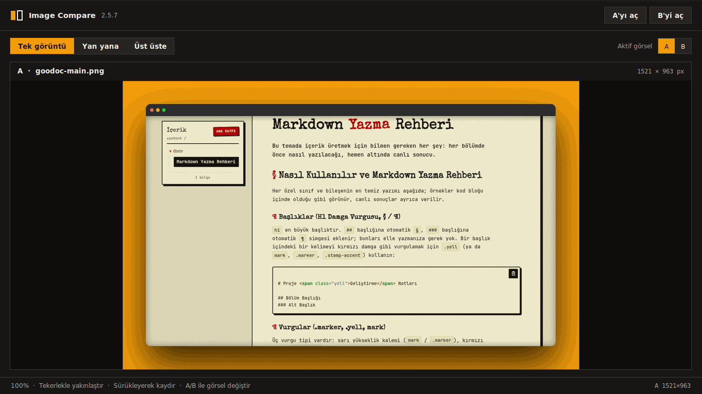

# Markdown <span class="yell">Yazma</span> Rehberi

<p class="lede">Bu temada içerik üretmek için bilmen gereken her şey: her bölümde önce nasıl yazılacağı, hemen altında canlı sonucu.</p>
## Nasıl Kullanılır ve Markdown Yazma Rehberi

Her özel sınıf ve bileşenin en temiz yazımı aşağıda; örnekler kod bloğu içinde olduğu gibi görünür, canlı sonuçlar ayrıca verilir.

### Başlıklar (H1 Damga Vurgusu, § / ¶)

`h1` en büyük başlıktır. `##` başlığına otomatik `§`, `###` başlığına otomatik `¶` simgesi eklenir; bunları elle yazmanıza gerek yok. Bir başlık içindeki bir kelimeyi kırmızı damga gibi vurgulamak için `.yell` (ya da `mark`, `.marker`, `.stamp-accent`) kullanın:

```html
# Proje <span class="yell">Geliştirme</span> Notları

## Bölüm Başlığı
### Alt Başlık
```

### Vurgular (.marker, .yell, mark)

Üç vurgu tipi vardır: sarı yükseklik kalemi (`mark` / `.marker`), kırmızı uyarı (`span.yell` gövde metninde), ve başlık içinde kırmızı damga (`h1 .yell`):

```html
Normal metin <mark>sarı vurgu</mark> ve <span class="marker">marker ile işaretli</span>.
Uyarı: <span class="yell">kritik ayar</span> kontrol edilmeli.
```

Canlı sonuç:

Normal metin <mark>sarı vurgu</mark> ve <span class="marker">marker ile işaretli</span>. Uyarı: <span class="yell">kritik ayar</span> kontrol edilmeli.

### Giriş Paragrafı (Lede)

İlk paragrafı öne çıkarmak için `.lede` sınıfını kullanın:

```html
<p class="lede">Bu döküman, temayı test etmek için hazırlandı.</p>
```

Bu sayfanın giriş paragrafı canlı bir `.lede` örneğidir.

### Listeler (Madde, Numaralı Kurallar, Görev Listeleri)

Sırasız liste, numaralı "kural" listesi ve görev listesi desteklenir:

```markdown
- Madde bir
- Madde iki

1. İlk kural
2. İkinci kural

- [ ] Yapılacak görev
- [x] Tamamlanan görev
```

Canlı:

- Madde bir
- Madde iki

1. İlk kural
2. İkinci kural

Not: Pandoc görev listelerini varsayılan olarak devre dışı (görüntüleme amaçlı) üretir. Etkileşimli, tıklanabilir bir seçim için aşağıdaki radyo/onay kutusu desenini kullanın.

### Blok Alıntılar ve Exhibit

`blockquote` sol kırmızı kenarlık ve hafif eğimle çizilir. Bir "exhibit" etiketi eklemek için `.exhibit-label` kullanın:

```html
> <span class="exhibit-label">EXHIBIT A — Hatırlatma</span>
> Bu konuda kesin bir fikrim yok demek, yanlış bilgiden her zaman daha değerlidir.
```

Canlı sonuç:

> <span class="exhibit-label">EXHIBIT A — Hatırlatma</span>
> Bu konuda kesin bir fikrim yok demek, yanlış bilgi üretip paylaşmaktan her zaman daha değerlidir.

### Tablolar (Zebra)

Standart Markdown boru tablosu kullanın; başlık şeritli ve satırlar zebra desenlidir. Tablo, içerik alanının tamamını kaplayan %100 genişlikte oluşur; dar ekranlarda sütunlar metni sararak düzgün yerleşir:

```markdown
| Sütun A | Sütun B | Durum |
|----------|----------|-------|
| Değer 1  | Değer 2  | Hazır  |
| Değer 3  | Değer 4  | Bekliyor |
```

Canlı sonuç:

| Sütun A | Sütun B | Durum |
| Değer 1 | Değer 2 | Hazır |
| Değer 3 | Değer 4 | Bekliyor |

### Kod Blokları ve Kopyala Butonu

Fenced kod blokları (```) sözdizimi vurgulamalı üretilir; sağ üst köşedeki simgeye tıklayınca kod panoya kopyalanır ve simge 2 saniyeliğine tike döner.

```bash
pandoc dokuman.md -o dokuman.html --standalone -c retro-doc.css
```


### Görseller, Retro Çerçeve ve Lightbox

Tüm görseller otomatik retro kağıt çerçeveye alınır (`figure` veya tek başına ``). Tıklayınca lightbox %150 zoom ile açılır; sadece resim hareket eder, caption ve toolbar sabit kalır.

**Canlı örnek — dokümandaki gibi görünür:**

<figure>
  
  <figcaption><span class="exhibit-label">GÖRSEL — Örnek</span> Tek görüntü modu (1494×1078 px). Üzerine gelince %0.5 büyür, tıklayınca lightbox %150 ile açılır — tekerlek/drag/pinch ile sadece resim hareket eder (caption sabit).</figcaption>
</figure>

**Kullanım — iki yol:**

1. *Markdown tek satır* (otomatik çerçeve + lightbox):
```markdown

```

2. *Figür + açıklama* (tavsiye edilen, retro etiketiyle):
```html
<figure>
  
  <figcaption><span class="exhibit-label">GÖRSEL — ImageCompare 2.5.7</span> Tek görüntü modu. Üstte sekmeler, ortada grafik.</figcaption>
</figure>
```

**Davranış:**

- Hover'da görsel `%0.5` büyür; çerçeve kağıt dolgu + ink sınır + sert gölge + hafif eğimdir.
- Lightbox `%150` ile açılır; tekerlek, sürükleme ve pinch ile yakınlaştırma ve pan.
- Kısayollar: `+` / `-` zoom, `0` sıfırla, `Esc` kapat; çift tık `%100 ↔ %150` geçişi.
- Yüklenemeyen görselde caption "Görsel yüklenemedi" olur.
- `build.py` script'i her sayfaya otomatik ekler; elle kurulum için `lightbox.js`'i `retro-doc.css` yanına koyup sayfa sonuna ekle.

**Görsel yolları:** yolu her zaman `.md` dosyasının yanına göre yaz; şu dört konum da çalışır:

```text
content/docs/foo.md  + content/_attachments/resim.png       → global
content/linux/foo.md + content/linux/_attachments/bar.png   → dosyanın yanında
content/linux/foo.md + content/_attachments/linux/bar.png   → aynalı
proje kökü           + _attachments/linux/bar.png           → kök aynalı
```

`build.py` adayları sırayla arar, bulduğunu `build/` altına aynı yapıda kopyalar ve `src`'yi sayfaya göre yeniden yazar. Yazım kuralı tek: `` ya da ``.

### Bileşenler (Shout, CTA, İmza, Altlık)

```html
<div class="shout">Büyük uyarı kutusu. <span>Vurgulu kısım.</span></div>

<p class="u-center u-mt-lg">
  <a class="cta-angry" href="angry.html">Öfkeli sürüme git →</a>
</p>

<div class="signature">
  <div class="name">— birisi,<br>ekip arkadaşın</div>
  <small>bilerek, bir insan tarafından yazıldı.</small>
</div>

<div class="footer">
  <p>Çoğunlukla hiciv.</p>
</div>
```

Canlı sonuçlar:

<div class="shout">Büyük uyarı kutusu. <span>Vurgulu kısım.</span></div>

<p class="u-center u-mt-lg"><a class="cta-angry" href="#">Öfkeli sürüme git →</a></p>

<div class="signature">
  <div class="name">— birisi,<br>ekip arkadaşın</div>
  <small>bilerek, bir insan tarafından yazıldı.</small>
</div>

<div class="footer">
  <p>Çoğunlukla hiciv. Paylaşmak, uyarlamak ve çevirmek serbest.</p>
</div>

`.cta-calm` yeşil, sakin bir alternatif buton stilidir; `.cta-angry` ile aynı biçimde kullanılır:

```html
<a class="cta-calm" href="calm.html">Sakin sürüme git →</a>
```

### Durum Göstergesi (Radyo / Onay Kutusu)

Bu bileşen bir durumu göstermek içindir: durumu `dokuman.md` içinde ilgili seçeneğe `checked` ekleyerek belirlersin. Sitede ziyaretçi değiştiremez; kilit CSS'te (`.choice` üzerinde `pointer-events: none`) çözülür ve input'lara `tabindex="-1"` eklenir, böylece `disabled` gerekmez ve görünüm normal kalır. Radyo tek seçim, onay kutusu çoklu seçim içindir; görünüm tamamen özel CSS ile çizilir:

```html
<fieldset class="choice-group">
  <legend>Aşama Seç</legend>
  <label class="choice"><input type="radio" name="asama" value="taslak" tabindex="-1"> Taslak oluştur</label>
  <label class="choice"><input type="radio" name="asama" value="inceleme" checked tabindex="-1"> İnceleme talep edildi</label>
</fieldset>

<fieldset class="choice-group">
  <legend>Yapılacaklar</legend>
  <label class="choice"><input type="checkbox" name="todo" value="taslak" checked tabindex="-1"> Proje taslağını oluştur</label>
  <label class="choice"><input type="checkbox" name="todo" value="inceleme" tabindex="-1"> İnceleme talep et</label>
</fieldset>
```

Canlı görünüm:

<fieldset class="choice-group">
  <legend>Aşama Seç</legend>
  <label class="choice"><input type="radio" name="asama" value="taslak" tabindex="-1"> Taslak oluştur</label>
  <label class="choice"><input type="radio" name="asama" value="inceleme" checked tabindex="-1"> İnceleme talep edildi</label>
  <label class="choice"><input type="radio" name="asama" value="yayin" tabindex="-1"> Yayına al</label>
</fieldset>

<fieldset class="choice-group">
  <legend>Yapılacaklar</legend>
  <label class="choice"><input type="checkbox" name="todo" value="taslak" checked tabindex="-1"> Proje taslağını oluştur</label>
  <label class="choice"><input type="checkbox" name="todo" value="inceleme" tabindex="-1"> İnceleme talep et</label>
  <label class="choice"><input type="checkbox" name="todo" value="test" tabindex="-1"> Canlı ortamda test et</label>
  <label class="choice"><input type="checkbox" name="todo" value="yayin" tabindex="-1"> Yayına al</label>
</fieldset>

### Görev Listeleri (Todo) — Display-Only ve Boşluk

Pandoc'un `- [ ]` / `- [x]` görev listesi bu temada **display-only** kilitlidir — tıpkı `choice-group` gibi `pointer-events:none` ile ziyaretçi değiştiremez, `checked` durumu `dokuman.md` kaynağında belirlenir. Kareler `choice` ile aynı retro stil: `1.15rem`, `2px ink` çerçeve, `ink` dolgu + sarı tik, `border-radius:2px`.

Kareler `choice` bileşeniyle aynı retro stili alır; `checked` durumu kaynağında belirlenir, ziyaretçi değiştiremez.

```markdown
- [ ] Gerekirse --hwdec=auto eklemeyi değerlendir
- [x] v0.6.0 yayımlandı
```

Canlı todo (tıklanamaz, sadece gösterir):

- [ ] Gerekirse `--hwdec=auto` donanım hızlandırma bayrağını varsayılan eklemeyi değerlendir
- [x] Retro çerçeve + lightbox eklendi

### Otomatik Site (content/ → build/)

`content/` içine (alt klasör dahil) attığın her `.md` otomatik sitede görünür. Derleme:

```bash
python3 build.py   # content/**/*.md → build/**/*.html + sidebar + _attachments
```

* `content/` → `build/` aynalı: `content/linux/foo.md` → `build/linux/foo.html` (klasör yapısı korunur)
* `retro-doc.css` + `lightbox.js` her sayfaya göreli yolla eklenir; fontlar `<link rel="preconnect">` ile yüklenir
* Pandoc çağrısı `sanitize_title()` ile güvenli başlık kullanır
* Hatalar loglanır; her `md` tek kez okunur
* `src`/`href` çift/tek tırnak farkı gözetmeksizin düzeltilir
* Sidebar `contentTree`: aktif sayfa vurgulu, mobilde `☰` ile açılan çekmece
* Ana dizinde **Son Eklenenler** sayfası: en yeni 8 belge, kartlarda başlık/klasör/tarih/özet
* `content/` dışındaki `_attachments` aynalı mimarisi de desteklenir

### İlgili Sayfalar

* [Örnek Sayfa](ornek.md) — iç link yönlendirmesini ve temel bileşenleri gösteren kısa test sayfası

### Dekoratif Damga ve Karalama (Stamp / Scribble)

İsteğe bağlı, salt görsel süsleme öğeleridir; `.sheet` veya `body`'ye göre konumlanır ve `pointer-events: none` ile etkileşimden muaftır. Uzun sayfalarda birden fazla `.scribble-N` konumu tanımlayabilirsiniz:

```html
<span class="stamp">Onaylandı</span>
<span class="scribble scribble-1">bkz. dipnot →</span>
```

### Yararlı Hizalama Sınıfları

`.u-center` (ortala), `.u-muted` (sönük metin), `.u-small` (küçük metin), `.u-mt-lg` / `.u-mt-md` (üst boşluk) gibi yardımcı sınıflar hizalamayı kolaylaştırır:

```html
<p class="u-center u-small u-muted">Küçük, ortalı, sönük bir not.</p>
```

Canlı: <p class="u-center u-small u-muted">Küçük, ortalı, sönük bir not.</p>

